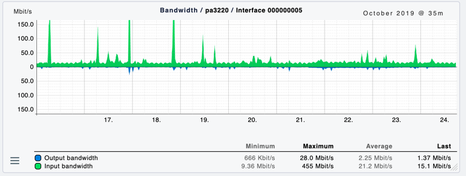

# Untitled

## Getting Super Powers

Becoming a super hero is a fairly straight forward process:

```
$ give me super-powers
```

This is what a desk pop looks like




```
// Ain't no code for that yet, sorry
echo 'You got to trust me on this, I saved the world'
```



